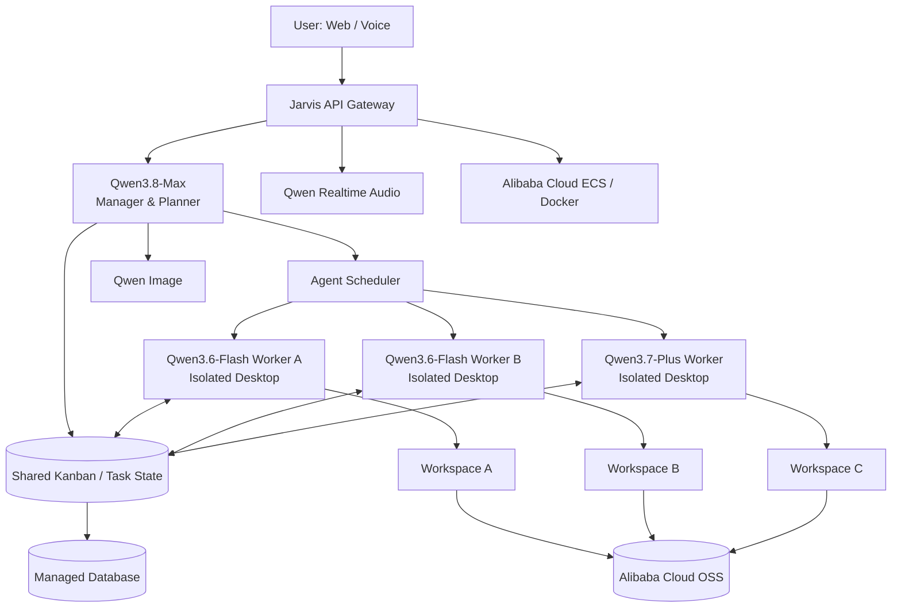

# Jarvis

> **A multi-agent AI workstation on Alibaba Cloud, orchestrated by Qwen.**

Jarvis is an experimental personal AI system designed around a hierarchy of specialized Qwen agents. A central manager plans work, delegates tasks, launches additional workers when parallel execution can reduce latency, and keeps every agent synchronized through a shared Kanban-style coordination layer.

The project is intended to run on **Alibaba Cloud** using **Model Studio**, **ECS**, **Docker**, **OSS**, and a managed database.

## Project goals

- Build a fast, multimodal personal AI assistant.
- Route simple work to low-latency models and reserve stronger models for difficult tasks.
- Give every agent its own isolated desktop and work environment.
- Allow multiple agents to work on the same objective in parallel.
- Keep agents synchronized through a shared Kanban board with task state, dependencies, blockers and artifacts.
- Let the manager dynamically create extra workers when doing so shortens the critical path.
- Support text, image generation and real-time voice interaction.
- Keep infrastructure reproducible with containers and cloud-native storage.

## Planned model routing

| Role | Planned model | Responsibility |
|---|---|---|
| Manager / Planner | `qwen3.8-max` | Decompose objectives, plan execution, assign work, resolve dependencies, review results and decide when more workers are needed |
| General worker | `qwen3.7-plus` | Complex reasoning, coding, research, multimodal work and tool-heavy tasks |
| Fast worker | `qwen3.6-flash` | Low-latency tasks, lightweight subtasks, classification, extraction and parallel burst capacity |
| Image generation | `qwen-image-3.0-pro` | Generate and edit visual assets |
| Realtime voice | `qwen-audio-3.0-realtime-plus` | Live voice interaction and audio workflows |

Model names are kept configurable through environment variables so the system can be upgraded without redesigning the orchestration layer.

## Multi-agent execution

Jarvis treats an agent as more than a chat session. Each worker receives an isolated runtime with its own:

- desktop / graphical session where required;
- filesystem workspace;
- browser and terminal tools;
- task-specific context;
- temporary credentials and scoped permissions;
- artifact directory;
- execution logs and status heartbeat.

The manager can run workers in parallel. For example, if one `qwen3.6-flash` worker is processing a long batch while an independent task is ready, `qwen3.8-max` can request another fast worker instead of forcing the second task to wait.

## Shared Kanban coordination layer

The Kanban board acts as the system's shared source of truth rather than relying on agents to infer what the others are doing.

Each card can contain:

- task ID and parent objective;
- assigned agent and model;
- status: `backlog`, `ready`, `running`, `blocked`, `review`, `done`;
- dependencies and blockers;
- current progress / heartbeat;
- produced files and artifacts;
- estimated cost and runtime;
- retry / escalation information.

Agents update their cards while they work. The manager watches board state, identifies idle capacity and blocked critical-path tasks, and can scale workers up or down accordingly.

## Architecture



A more detailed design is available in [`docs/architecture.md`](docs/architecture.md).

## Alibaba Cloud deployment plan

| Component | Alibaba Cloud role |
|---|---|
| Model inference | Model Studio / Qwen APIs |
| Orchestrator API | ECS container workload |
| Agent runtimes | Isolated Docker workloads on ECS |
| Generated media / artifacts | OSS |
| Persistent task & agent state | Managed relational database |
| Queue / short-lived coordination | Redis-compatible service or local Redis during development |
| Secrets | Environment / secret-management layer; never committed to Git |

## Repository structure

```text
Jarvis/
├── README.md
├── .env.example
├── .gitignore
├── docker-compose.yml
├── docs/
│   ├── architecture.md
│   ├── agent-protocol.md
│   └── alibaba-application.md
└── services/
    └── README.md
```

## Local development

The initial Compose stack provides PostgreSQL and Redis for local orchestration development. In production these components can be replaced with Alibaba Cloud managed services while ECS hosts the application and agent containers.

```bash
cp .env.example .env
docker compose up -d
```

No API keys should ever be committed. Add Alibaba Cloud credentials only to your local `.env` or production secret store.

## Scaling concept

The scheduler does not simply create agents indefinitely. A scale-out request should be based on useful parallelism, available budget and task dependencies.

Example decision:

```text
Objective
  -> Manager creates 5 tasks
  -> 2 tasks are independent and ready
  -> Flash Worker A starts Task 1
  -> Task 2 would otherwise wait
  -> Manager requests Flash Worker B
  -> Both workers update the Kanban board
  -> Manager reviews both outputs and unlocks Task 3
```

Planned safeguards include concurrency limits, per-task budgets, timeout limits, idempotent task claims and automatic worker shutdown after idle periods.

## Roadmap

- [x] Define the cloud and multi-agent architecture
- [x] Define model routing responsibilities
- [x] Define shared Kanban coordination protocol
- [ ] Implement Model Studio client abstraction
- [ ] Implement task database and event stream
- [ ] Implement manager / scheduler service
- [ ] Implement isolated worker runtime
- [ ] Implement browser + desktop automation environment
- [ ] Implement Kanban web UI
- [ ] Add Qwen image generation
- [ ] Add realtime Qwen audio session
- [ ] Add OSS artifact storage
- [ ] Deploy first ECS prototype
- [ ] Add observability, budgets and autoscaling policies

## Project status

**Architecture / early prototype.** This repository currently documents the intended system design and provides the initial development environment. Implementation will be added incrementally as the Alibaba Cloud prototype is built.

## Why Alibaba Cloud?

The project is intentionally designed to evaluate a full Alibaba Cloud AI stack rather than only a single model endpoint: Qwen model routing in Model Studio, containerized workloads on ECS, persistent state in managed cloud services and generated artifacts in OSS.

---

Built as an independent developer project for experimenting with scalable, coordinated AI agents on Alibaba Cloud.
